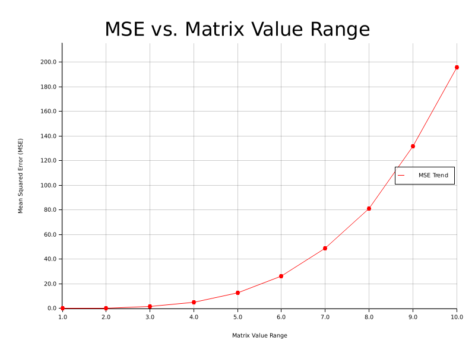

# 4-Bit Quantized Matrix Multiplication
In this lab, I explore 4-bit quantized matrix multiplication, using BLAS' FP32 matrix multiplication as the baseline.

## 4-Bit Affine Quantization
Affine quantization maps float values $x\in [x_{\min},\ x_{\max}]$ to some $q\in [q_{\min},\ q_{\max}]$ by the following scheme:

$$q = \text{round}(\frac{x}{S} + Z)$$

where $S,Z$ are the quantization parameters.

The real value can be restored by:

$$x^\prime = S(q - Z)$$

however, in general $x\neq x^\prime$. Their difference makes up the quantization error.
 
$S$ scales the input range to the output range, and $Z$ is the zero point, ensuring that the 0 of the input range is perfectly mapped to it.

$$S=\frac{x_{\max}-x_{\min}}{q_{\max}-q_{\min}}$$

$$Z=q_{\min} - \frac{x_{\min}}{S}$$

In this lab, the quantization range is $[0,\ 15]$ since we are quantizing to 4-bit values. 

In practice, it's possible to get an input value which is outside of the input range. For example, when quantizing a matrix, outlier values can be excluded from the range to reduce their impact on the majority of values. However, this means that the output $q$ can end up outside of the output range. To handle this, I decided to clamp the output value to the range.

Thus, I implemented it as such:
```Rust
impl AffineQuantizer {
    pub fn new(min_val: f32, max_val: f32) -> Self {
        // to avoid edge case of min_val = max_val, pad range
        let min_val = min_val - 1e-6;
        let max_val = max_val + 1e-6;
        let scale = (max_val - min_val) / 15.0; // 4-bit range
        let zero = (-min_val / scale).round().clamp(0., 15.) as u8;
        AffineQuantizer { scale, zero }
    }
}

impl Quantizer4Bit for AffineQuantizer {
    fn quantize(&self, real_val: f32) -> u8 {
        (real_val / self.scale + self.zero as f32)
            .clamp(0., 15.)
            .round() as u8
    }

    fn dequantize(&self, q_val: u8) -> f32 {
        self.scale * (q_val as f32 - self.zero as f32)
    }
}
```

## Quantized Matrix Multiplication
I created a simple matrix type which stores the elements in a flatten vector
```Rust
#[derive(PartialEq, Debug)]
pub struct Matrix<T> {
    pub data: Vec<T>,
    pub rows: usize,
    pub cols: usize,
}
```

First, the float matrices need to be quantized. The RHS matrix is transposed beforehand, so that it is stored in column-major order. This way, the columns are stored in contiguous memory, which improves cache utilization. This also makes SIMD vectorization simpler to implement.

Now, the matrices can be multiplied. I did not want to eagerly unpack the matrices into 32-bit int accumulators, since it would reduce the memory savings. My plan was to unpack each row and column when it was needed, and compute their dot-product using accumulators. This way, only 2 vectors are stored with 32-bit ints. 

These dot-products need to be computed using the formula to estimate the float value from above, which was $x^{\prime}=S(q-Z)$. The issue is that we do not want to clog the kernel with too many computations. To avoid this, I used a trick from [gemmlowp](https://github.com/google/gemmlowp), allowing me to multiply the quantized matrices then later update the resulting matrix to get the estimated float values. Their explanation of the trick is below. "Offset" corresponds to $-Z$.

---
Let `P` denote the matrix shaped like `lhs`, but filled with 1's.

Let `Q` denote the matrix shaped like `rhs`, but filled with 1's.

Adding lhs_offset to each entry of `lhs`, means adding `lhs_offset * P` to
`lhs`.

Adding rhs_offset to each entry of `rhs`, means adding `rhs_offset * Q` to
`rhs`.

Thus, as far as handling `lhs_offset` and `rhs_offset` goes, the matrix product
to be computed is:

```
(lhs + lhs_offset * P) * (rhs + rhs_offset * Q)
```

Expanding this (using distributivity of matrix multiplication over addition), we
see that the above product is equal to the following sum of 4 terms:

```
  lhs * rhs                                 (2)
+ lhs_offset * P * rhs
+ lhs * rhs_offset * Q
+ lhs_offset * rhs_offset * P * Q
```

The first term, `lhs * rhs`, is just the matrix multiplication ignoring the
offsets, i.e. as if `lhs_offset==rhs_offset==0`. Our claim here is that this is
all what we have to compute in the GEMM kernel.

In the second term, `lhs_offset * P * rhs`, notice that since P is filled with
1's, `P * rhs` has all its rows equal to each other, and equal to the row-vector
of sums of all the entries in each column of rhs.

Thus, we can compute the second term, `lhs_offset * P * rhs`, by summing each
column of rhs. This produces a single row-vector, and in order to add the second
term, we simply need to add this row-vector (multiplied by lhs_offset) to each
row of the result. This is just a rank one update of the result (equivalently,
the second term is a rank one matrix), and we can efficiently store it as a
single vector.

The third term, `lhs * rhs_offset * Q`, is entirely similar to the second one,
and can be similarly computed by summing each row of lhs, storing this in a
single column-vector, and later multiplying these sums by rhs_offset.

The fourth term is a single constant, repeated into all the entries of the
matrix. The matrix `P * Q` is filled with the single constant value 'depth' (the
depth of the matrix product i.e. the number of columns of the lhs). Thus the
fourth term is simply the rank zero update adding this constant to each matrix
entry:

```
lhs_offset * rhs_offset * depth
```

---

Now, how about the scale, $S$? It is a float value, so we do not want to use it in the matrix multiplication. Luckily, the scale can be approximated using fixed point multiplication. This is another thing I learned from gemmlowp. I implemented this function to return a fixed-point, integer multiplier and a right shift amount given a real multiplier.
```Rust
/// Given a real_multiplier in (0, 1), produces a quantize_multiplier (in Q31 format), rshift pair that can be used to to approximate:
/// real_multiplier * x
///
/// by computing:
/// rounding_rshift(FixedPointMultiply(quantized_multiplier, x), rshift)
pub fn quantize_multiplier(mut real_multiplier: f32) -> (i32, i32) {
    assert!(real_multiplier > 0.);
    assert!(real_multiplier < 1.);

    let mut s = 0;
    // Bring the real multiplier into the interval [1/2, 1).
    while real_multiplier < 0.5 {
        real_multiplier *= 2.0;
        s += 1;
    }

    // Now that the real multiplier is in [1/2, 1), we convert it
    // into a fixed-point number.
    let mut q = (real_multiplier * (1_i64 << 31) as f32).round() as i64;
    assert!(q <= (1_i64 << 31));
    // Handle the special case when the real multiplier was so close to 1
    // that its fixed-point approximation was undistinguishable from 1.
    // We handle this by dividing it by two, and remembering to decrement
    // the right shift amount.
    if q == (1_i64 << 31) {
        q /= 2;
        s -= 1;
    }

    assert!(s >= 0);
    assert!(q <= i32::MAX as i64);
    (q as i32, s)
}
``` 

Originally, I heavily packed the 4-bit values to minimize wasted storage. This allowed for rows/columns to begin and end in the middle of a byte. 
```Rust
/// Quantize and pack values into a row-major matrix
pub fn quantize_lhs(&self, quantizer: &impl Quantizer4Bit) -> Matrix<u8> {
    let mut quantized_lhs = Matrix::<u8>::new_quantized(self.rows, self.cols);
    Self::quantize(&self, &mut quantized_lhs, quantizer);
    quantized_lhs
}

/// Quantize and pack values into a column-major matrix
pub fn quantize_rhs(&self, quantizer: &impl Quantizer4Bit) -> Matrix<u8> {
    let mut quantized_rhs = Matrix::<u8>::new_quantized(self.cols, self.rows);
    Self::quantize(&self.transpose(), &mut quantized_rhs, quantizer);
    quantized_rhs
}

fn quantize(matrix: &Self, dst: &mut Matrix<u8>, quantizer: &impl Quantizer4Bit) {
    for (i, chunk) in matrix.data.chunks(2).enumerate() {
        let v1 = chunk[0];
        let v2 = chunk.get(1).copied().unwrap_or(0.0);
        dst.data[i] = quantize_and_pack(quantizer, v1, v2)
    }
}
```

This would later cause problems for SIMD vectorization. For my first implementation, there was no issue.
```Rust
pub fn qmultiply(
        &self,
        other: &Self,
        lhs_offset: i32,
        rhs_offset: i32,
        result_offset: i32,
        q_multiplier: i32,
        rshift: i32,
    ) -> Matrix<u8> {
        let mut accumulators = Vec::<i32>::with_capacity(self.rows * other.cols);

        // stores extracted nibbles
        let mut lhs_row = Vec::<u8>::with_capacity(self.cols);
        unsafe { lhs_row.set_len(self.cols) };
        let mut rhs_col = Vec::<u8>::with_capacity(other.rows);
        unsafe { rhs_col.set_len(other.rows) };

        // to determine which nibble of byte to get
        let mut lower_bits_lhs = true;

        // store vectors that are a part of the optimization trick for adding offsets described above
        let mut rhs_offset_vec = Vec::with_capacity(self.cols);
        let mut lhs_offset_vec = Vec::with_capacity(other.rows);

        // only calculate lhs_offset_vec on first iteration
        let mut first = true;

        let mut i = 0;
        for _ in 0..self.rows {
            // Get next row from nibbles
            for row_idx in 0..self.cols {
                let next_val;
                if lower_bits_lhs {
                    next_val = self.data[i] & 0x0F
                } else {
                    next_val = self.data[i] >> 4;
                    i += 1;
                }
                lower_bits_lhs = !lower_bits_lhs;
                lhs_row[row_idx] = next_val;
            }

            rhs_offset_vec.push(lhs_row.iter().map(|&x| x as i32).sum::<i32>() * rhs_offset);

            let mut j = 0;
            let mut lower_bits_rhs = true;
            for _ in 0..other.cols {
                // Get next col from nibbles
                for col_idx in 0..other.rows {
                    let next_val;
                    if lower_bits_rhs {
                        next_val = other.data[j] & 0x0F
                    } else {
                        next_val = other.data[j] >> 4;
                        j += 1;
                    }
                    lower_bits_rhs = !lower_bits_rhs;
                    rhs_col[col_idx] = next_val;
                }

                if first {
                    lhs_offset_vec
                        .push(rhs_col.iter().map(|&x| x as i32).sum::<i32>() * lhs_offset);
                }

                let mut accumulator: i32 = 0;
                for k in 0..self.cols {
                    accumulator += lhs_row[k] as i32 * rhs_col[k] as i32;
                }
                accumulators.push(accumulator);
            }

            first = false;
        }

        let mut result = Vec::with_capacity(accumulators.len());

        // add offsets and multiplier
        let depth = self.cols as i32;
        for i in 0..self.rows {
            let row_start = i * other.cols;
            for j in 0..other.cols {
                let with_offset = accumulators[row_start + j]
                    + lhs_offset_vec[j]
                    + rhs_offset_vec[i]
                    + lhs_offset * rhs_offset * depth;
                let with_multiplier = result_offset
                    + rounding_rshift(fixed_point_multiply(with_offset, q_multiplier), rshift);

                result.push(with_multiplier.clamp(0, 15) as u8);
            }
        }

        Matrix {
            data: result,
            rows: self.rows,
            cols: other.cols,
        }
    }
```
I built the RHS offset column vector and LHS offset row vector as I extracted each vector. I made sure not to recalculate this every time I extract the column vectors (using the `first` variable). At first, I returned a `Matrix<i32>`, directly returning the accumulated values. I changed that to `u8`, and I should have also packed the result to save space.

My improved implementation added SIMD intrinsics (specifically: avx2), but first I address the issue I mentioned above about row/column boundaries being in between bytes. I updated the quantization of matrices, sacrificing some storage saving in the process (only when the depth of the matrix multiplication is odd - otherwise there is no sacrifice).
```Rust
/// Quantize and pack values into a row-major matrix
pub fn quantize_lhs(&self, quantizer: &impl Quantizer4Bit) -> Matrix<u8> {
    Self::quantize(&self, self.rows, quantizer)
}

/// Quantize and pack values into a column-major matrix
pub fn quantize_rhs(&self, quantizer: &impl Quantizer4Bit) -> Matrix<u8> {
    Self::quantize(&self.transpose(), self.rows, quantizer)
}

fn quantize(matrix: &Self, dimension: usize, quantizer: &impl Quantizer4Bit) -> Matrix<u8> {
    let mut data = vec![];
    // for each row/col
    for vec in matrix.data.chunks(dimension) {
        // group in pairs, and if odd pad with 0
        // this ensures that rows/cols boundaries are not in the middle of a byte
        for to_pack in vec.chunks(2) {
            let v1 = to_pack[0];
            let v2 = to_pack.get(1).copied().unwrap_or(0.0);
            data.push(quantize_and_pack(quantizer, v1, v2));
        }
    }

    Matrix {
        data,
        rows: matrix.rows,
        cols: matrix.cols,
    }
}
```

Now, I was able to vectorize the extraction of nibbles and the kernel of the function.
```Rust
pub unsafe fn qmultiply_simd(
    &self,
    other: &Self,
    lhs_offset: i32,
    rhs_offset: i32,
    result_offset: i32,
    q_multiplier: i32,
    rshift: i32,
) -> Matrix<u8> {
    let mut accumulators = vec![0; self.rows * other.cols];
    let mut result = Vec::with_capacity(accumulators.len());

    let depth = self.cols;
    let blocks = depth / 8;
    let blocked_depth = blocks * 8;
    let extra = depth - blocked_depth;
    let blocked_depth_bytes = blocks * 4;
    let depth_bytes = (depth + 1) / 2;

    let mut lhs_row_regs = vec![mem::zeroed(); blocks];
    let mut rhs_col_regs = vec![mem::zeroed(); blocks];

    // stores extracted nibbles
    // plus one: if row/col is odd, then the last nibble will be in lower nibble, meaning higher nibble (0) will be stored here too
    // the kernel skips this +1 element
    let mut lhs_row = vec![0; extra + 1];
    let mut rhs_col = vec![0; extra + 1];

    // store vectors that are a part of the optimization trick for adding offsets described above
    let mut rhs_offset_vec = vec![0; self.cols];
    let mut lhs_offset_vec = vec![0; other.rows];

    // only calculate lhs_offset_vec on first iteration
    let mut first = true;

    for (row, i) in (0..self.data.len()).step_by(depth_bytes).enumerate() {
        extract_nibbles(
            &self.data[i..i + depth_bytes],
            blocked_depth_bytes,
            depth_bytes,
            &mut lhs_row_regs,
            &mut lhs_row,
        );

        rhs_offset_vec[row] = (lhs_row_regs.iter().map(|&v| hsum_avx2(v)).sum::<i32>()
            + lhs_row.iter().sum::<i32>())
            * rhs_offset;

        for (col, j) in (0..other.data.len()).step_by(depth_bytes).enumerate() {
            extract_nibbles(
                &other.data[j..j + depth_bytes],
                blocked_depth_bytes,
                depth_bytes,
                &mut rhs_col_regs,
                &mut rhs_col,
            );
            if first {
                lhs_offset_vec[col] = (rhs_col_regs.iter().map(|&v| hsum_avx2(v)).sum::<i32>()
                    + rhs_col.iter().sum::<i32>())
                    * lhs_offset;
            }

            let acc_idx = row * self.cols + col;
            let mut vsum = _mm256_setzero_si256();
            for k in 0..blocks {
                let vlhs = lhs_row_regs[k];
                let vrhs = rhs_col_regs[k];
                let vprod = _mm256_mullo_epi32(vlhs, vrhs);
                vsum = _mm256_add_epi32(vsum, vprod);
            }
            accumulators[acc_idx] += hsum_avx2(vsum);

            // handle remainder sequentially
            for k in 0..extra {
                accumulators[acc_idx] += lhs_row[k] * rhs_col[k];
            }
        }

        first = false;
    }

    // add offsets and multiplier
    let depth = self.cols as i32;
    for i in 0..self.rows {
        let row_start = i * other.cols;
        for j in 0..other.cols {
            let with_offset = accumulators[row_start + j]
                + lhs_offset_vec[j]
                + rhs_offset_vec[i]
                + lhs_offset * rhs_offset * depth;
            let with_multiplier = result_offset
                + rounding_rshift(fixed_point_multiply(with_offset, q_multiplier), rshift);

            result.push(with_multiplier.clamp(0, 15) as u8);
        }
    }

    Matrix {
        data: result,
        rows: self.rows,
        cols: other.cols,
    }
}

// blocked_count must be a multiple of 8
unsafe fn extract_nibbles(
    data: &[u8],
    blocked_count: usize,
    total_count: usize,
    regs_dst: &mut [__m256i],
    extras_dst: &mut [i32],
) {
    // nibbles packed into m256i's
    let mut blocks = data.chunks_exact(4);
    for (i, _) in (0..blocked_count).step_by(4).enumerate() {
        let block = blocks.next().unwrap();
        let bytes = _mm_set_epi32(
            block[0] as i32,
            block[1] as i32,
            block[2] as i32,
            block[3] as i32,
        );
        let lower_nibbles = _mm_and_si128(bytes, _mm_set1_epi8(0x0F));
        let upper_nibbles = _mm_srli_epi32(bytes, 4);

        let unpacked_lo = _mm_unpacklo_epi32(lower_nibbles, upper_nibbles);
        let unpacked_hi = _mm_unpackhi_epi32(lower_nibbles, upper_nibbles);

        let mut appended = _mm256_castsi128_si256(unpacked_lo);
        appended = _mm256_insertf128_si256(appended, unpacked_hi, 1);

        regs_dst[i] = appended;
    }
    // extras go in i32 vector
    for (i, data_idx) in (blocked_count..total_count).enumerate() {
        let byte = data[data_idx];
        let lo = byte & 0x0F;
        let hi = byte >> 4;
        extras_dst[i] = lo as i32;
        extras_dst[i + 1] = hi as i32;
    }
}

#[inline]
unsafe fn hsum_avx2(v: __m256i) -> i32 {
    let sum = _mm256_hadd_epi32(v, v);
    let sum = _mm256_hadd_epi32(sum, sum);
    _mm256_extract_epi32(sum, 0) + _mm256_extract_epi32(sum, 4)
}
```

I split the depth of the matrix multiplication into blocks, and each block stored the nibbles of the row/column vector in a 256-bit avx registers as 32-bit integers. Thus, my block size is 8. To do this, I store the block in a 128-bit register, and generate 2 other 128-bit registers: one storing the lower nibbles by applying a bitmask to every packed `i32` and the other storing the upper nibbles by applying a right shift to every packed `i32`. I then interleave these 2 128-bit registers using `unpacklo` and `unpackhi`. The 2 resulting 128-bit registers are combined into a 256-bit register. Any remaining elements are stored in a `Vec<i32>`.

The kernel vectorization is simple, using multiplication and addition intrinsics to compute the dot product. The resulting vector is "horizontally added" (I'm disappointed there isn't a simple intrinsic for this). The remaining elements are handled sequentially.

#### Comparison: BLAS
I use BLAS' `sgemm` subprogram to be the baseline.

## Results
Runtime:


Unfortunately, quantization and SIMD alone was not enough to catch BLAS. On the final iteration, for square matrices of size 1000, `sgemm` finished in ~29 ms while `qmultiply_simd` took ~156 ms. By implementing the same optimizations BLAS does, such as cache-blocking (or tiling) and parallelization, my quantized matrix multiplication should out perform `sgemm`. 

MSE:



In this measure, square matrices of size 10 are used. We can see that as the (symmetrical) range of float values increases, MSE quickly adds up. This makes sense, as our quantization range is so small. If the matrices are made up of elements with magnitude less than 1, the MSE is approximately 0.02.

I also measure MSE as matrix size increases. Using float values in the range (-1, 1), we observe the following MSE relation. Not sure why.


## Further Compression
I implemented CSR and CSC representations of matrices. 
```Rust
#[derive(PartialEq, Debug)]
pub struct CsrMatrix<T> {
    pub data: Vec<T>,
    pub col_index: Vec<usize>,
    pub row_index: Vec<usize>,
    pub rows: usize,
    pub cols: usize,
}

#[derive(PartialEq, Debug)]
pub struct CscMatrix<T> {
    pub data: Vec<T>,
    pub row_index: Vec<usize>,
    pub col_index: Vec<usize>,
    pub rows: usize,
    pub cols: usize,
}
```

If the matrices are sparse after being quantized, they can be converted into CSR format and then be multiplied. Since the RHS matrix is stored in column-major, the CSC conversion is the same as CSR.
```Rust
pub fn from_packed_quantized(qm: &Matrix<u8>) -> Self {
    // quantized matrices are packed
    let qrowsize = (qm.cols + 1) / 2;

    let mut data = vec![];
    let mut col_index = vec![];
    let mut row_index = vec![0];

    let mut r_idx = 0;
    for row in qm.data.chunks(qrowsize) {
        for (c_idx, &element) in row.iter().enumerate() {
            if element == 0 {
                continue;
            }

            data.push(element);
            col_index.push(c_idx * 2); // becuase elements are packed
            r_idx += 1;
        }
        row_index.push(r_idx);
    }

    if data.len() == 0 {
        row_index = vec![];
    }

    CsrMatrix {
        data,
        col_index,
        row_index,
        rows: qm.rows,
        cols: qm.cols,
    }
}
```

My SpMM implementation is as follows.
```Rust
pub fn csr_qmultiply(
    &self,
    other: &CscMatrix<u8>,
    lhs_offset: i32,
    rhs_offset: i32,
    result_offset: i32,
    q_multiplier: i32,
    rshift: i32,
) -> CsrMatrix<u8> {
    let mut accumulators = vec![];
    let mut result_col_index = vec![];
    let mut result_row_index = Vec::<usize>::with_capacity(self.rows + 1);
    result_row_index.push(0);

    let mut rhs_offset_vec = vec![0; self.cols];
    let mut lhs_offset_vec = vec![0; other.rows];

    let row_len = self.row_index.len();
    let col_len = other.col_index.len();

    if row_len == 0 || col_len == 0 {
        return CsrMatrix::new(self.rows, other.cols);
    }

    for (row_num, &row_ptr) in self.row_index[..row_len - 1].iter().enumerate() {
        let row_start = row_ptr;
        let row_end = self.row_index[row_num + 1];

        rhs_offset_vec[row_num] = self.data[row_start..row_end]
            .iter()
            .map(|&x| x as i32)
            .sum::<i32>()
            * rhs_offset;

        for (col_num, &col_ptr) in other.col_index[..col_len - 1].iter().enumerate() {
            let col_start = col_ptr;
            let col_end = other.col_index[col_num + 1];

            lhs_offset_vec[col_num] = other.data[col_start..col_end]
                .iter()
                .map(|&x| x as i32)
                .sum::<i32>()
                * lhs_offset;

            let mut lhs_ptr = row_start;
            let mut rhs_ptr = col_start;

            let mut sum = 0;
            while lhs_ptr < row_end && rhs_ptr < col_end {
                match self.col_index[lhs_ptr].cmp(&other.row_index[rhs_ptr]) {
                    Ordering::Equal => {
                        let lhs_byte = self.data[lhs_ptr];
                        let (lhs_lo, lhs_hi) = (lhs_byte & 0x0F, lhs_byte >> 4);

                        let rhs_byte = other.data[rhs_ptr];
                        let (rhs_lo, rhs_hi) = (rhs_byte & 0x0F, rhs_byte >> 4);

                        sum += lhs_lo as i32 * rhs_lo as i32 + lhs_hi as i32 * rhs_hi as i32;
                        lhs_ptr += 1;
                        rhs_ptr += 1;
                    }
                    Ordering::Greater => rhs_ptr += 1,
                    Ordering::Less => lhs_ptr += 1,
                }
            }

            accumulators.push(sum);
            result_col_index.push(col_num);
        }

        result_row_index.push(accumulators.len());
    }

    // add offsets and multiplier
    let mut result = vec![];
    let depth = self.cols as i32;
    let res_row_len = result_row_index.len();

    for (i, &row_start) in result_row_index[..res_row_len - 1].iter().enumerate() {
        let row_end = result_row_index[i + 1];

        for (j, _) in (row_start..row_end).enumerate() {
            let with_offset = accumulators[row_start + j]
                + lhs_offset_vec[result_col_index[row_start + j]]
                + rhs_offset_vec[i]
                + lhs_offset * rhs_offset * depth;
            let with_multiplier = result_offset
                + rounding_rshift(fixed_point_multiply(with_offset, q_multiplier), rshift);
            let casted = with_multiplier.clamp(0, 15) as u8;

            if casted != 0 {
                result.push(casted);
            }
        }
    }

    CsrMatrix {
        data: result,
        col_index: result_col_index,
        row_index: result_row_index,
        rows: self.rows,
        cols: other.cols,
    }
}
```
It is essentially the same as before, but I use `self.row_indices` and `other.col_indices` to delimit the row and column vectors respectively. Also, unpacking is deferred until the kernel since the chances are computations in the dot product can be skipped since it will be 0. The dot product of the row and column vectors was a little tricky since they may have a different number of non-zero elements. To ensure that the corresponding elements are multiplied without a quadratic traversal, I used the fact that column/row indices of each row/vector are sorted and implement a two-pointer style approach.

## Other Quantization Schemes: Logarithmic Quantization
To combat the issue of becoming inaccurate as input range increases, my research lead me to logarithmic quantization. I implemented a simple scheme as follows.
```Rust
impl LogQuantizer {
    pub fn new(min_val: f32, max_val: f32) -> Self {
        let min_val = min_val - 1e-6;
        let max_val = max_val + 1e-6;
        let scale = (max_val.log2() - min_val.log2()) / 15.0; // 4-bit range
        LogQuantizer { scale }
    }
}

impl Quantizer4Bit for LogQuantizer {
    fn quantize(&self, real_val: f32) -> u8 {
        (real_val.log2() / self.scale).clamp(0., 15.).round() as u8
    }

    fn dequantize(&self, q_val: u8) -> f32 {
        2.0f32.powf(q_val as f32 * self.scale)
    }
}
```
However, when it came to using this scheme on matrix multiplications, I struggled to find a similar way to "update" the resulting matrix at the end, as I did with affine quantization using the trick from gemmlowp. A correct implementation should greatly reduce MSE, allowing quantized matrix multiplication to be used on larger input ranges.

## Conclusion
By representing our matrices in lower precision, we are able to greatly speed up computation and reduce memory usage, at the expense of accumulating some error. 
